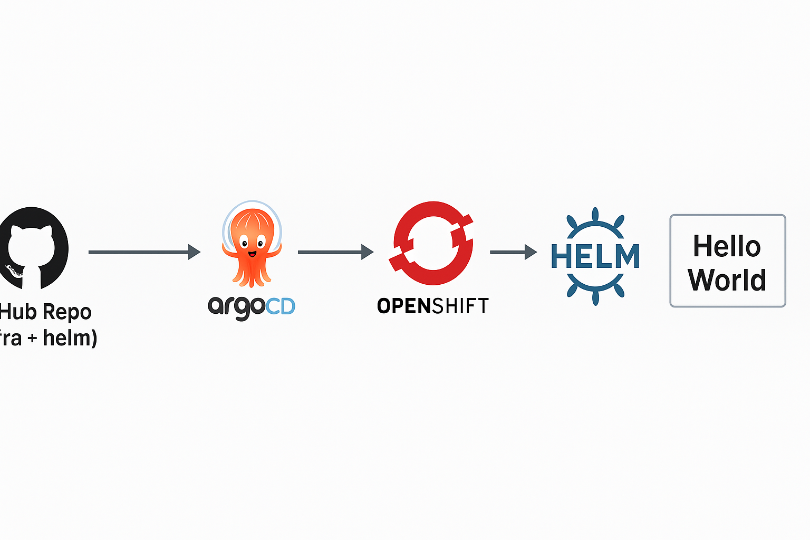

# ArgoCD Helm HelloWorld Bootstrap for OpenShift

This project demonstrates how to bootstrap infrastructure components and deploy a simple Hello World application on OpenShift using ArgoCD and Helm.

It follows GitOps best practices, using ArgoCD to manage both the infrastructure and application lifecycle.

## Repository Structure

- **/manifests**: Contains all infrastructure manifests including:
  - Namespace
  - ServiceAccount
  - StorageClass (Azure Disk based)
  - PersistentVolumeClaim
  - ResourceQuota
  - LimitRange

- **/helm/hello-world**: Helm chart to deploy the Hello World application.

- **argocd-app-bootstrap.yaml**: ArgoCD Application manifest to bootstrap the infrastructure.

- **argocd-app-hello-world.yaml**: ArgoCD Application manifest to deploy the Hello World application using Helm.

## Deployment Steps

1. **Bootstrap Infrastructure**
   - Apply `argocd-app-bootstrap.yaml` via ArgoCD to create required infra components.

2. **Deploy Hello World Application**
   - Apply `argocd-app-hello-world.yaml` via ArgoCD to deploy the application into the `hello-world` namespace.

ArgoCD will automatically sync and deploy the resources.

## Validation

After syncing the ArgoCD Applications, validate the deployments using the following commands:

### 1. Verify Namespace Creation

```bash
oc get ns hello-world
```

### 2. Verify PersistentVolumeClaim (PVC)

```bash
oc get pvc -n hello-world
```

### 3. Verify Deployment and Pods

```bash
oc get deployment -n hello-world
oc get pods -n hello-world
```

### 4. Verify Route and Access the Application

```bash
oc get route -n hello-world
```
- Open the URL listed under HOST/PORT in your browser.
- You should see the default Nginx Welcome Page.

## Notes
- The StorageClass is configured for Azure Managed Disks (Standard_LRS).
- PVC dynamically provisions Azure Disks when deployed.
- Route is configured with TLS Edge termination.

This project has been tested on OpenShift 4.x clusters.

## Architecture


##### Feel free to fork and customize it for your own needs!
---
